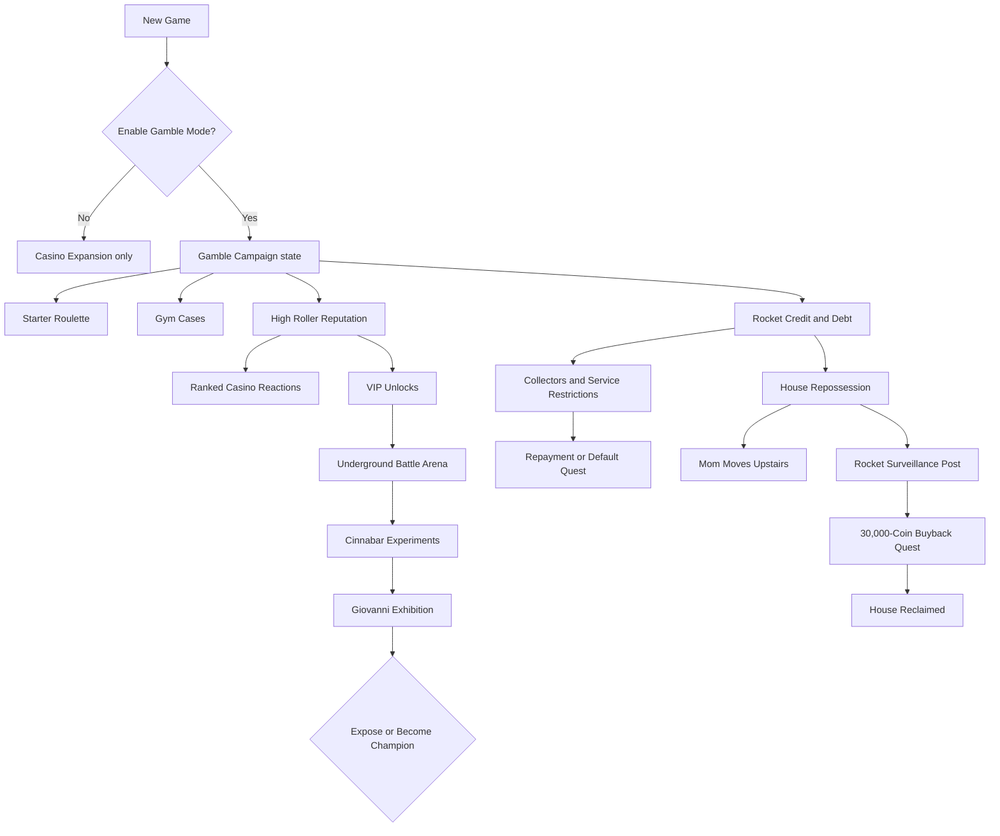

# Gamble Mode Campaign Roadmap

Status: APPROVED  
Target branch: `feat/v0.5-high-roller`  
First target release: `v0.5.0`  
Last updated: 2026-08-09

## Product shape

Blackjack Corner has two distinct layers.

### Casino Expansion

This is the base mod and remains available whether Gamble Mode is enabled or
not:

- The expanded Celadon Game Corner and its separate Casino Lounge.
- The Pallet Casino.
- Blackjack, house-banked Texas Hold'em, Crash, Tube Flyer, Prize Case, Horse
  Racing, and Plinko.
- The expanded Coin Case, bulk coin exchange, prize counters, shiny upgrades,
  hidden coins, and Pokemon pawning.

Players who decline Gamble Mode keep the expanded casinos without changing the
main adventure, its Gym rewards, the starter choice, or the wider world.

### Gamble Mode Campaign

Gamble Mode is an optional alternate campaign selected before a new game. It
changes how the casinos, economy, story, and NPCs react to the player:

- The starter is won through a roulette.
- Gym Leaders award one-prize Gym Cases instead of their direct TMs.
- Every casino game feeds a shared High Roller reputation.
- Rocket credit, debt, collectors, and repossession create consequences.
- The Pallet family home can become a Rocket surveillance post.
- A concealed Celadon arena offers betting on AI-controlled Pokemon battles.
- A Cinnabar and Giovanni storyline closes the campaign.

The two layers must stay separate. Gamble Mode campaign checks must never make
the base Casino Expansion less playable.

## Experience thesis

The casinos should feel like one evolving underworld rather than a collection
of unrelated minigames. Every wager advances a shared identity. Casino workers
remember the player, rooms open up, losing changes conversations, and accepting
credit creates visible consequences outside the casino.

The player should feel three simultaneous progressions:

1. **Pokemon progression:** badges, party strength, and story milestones.
2. **Casino progression:** lifetime action, victories, reputation, and rank.
3. **Underworld progression:** debt, Rocket attention, the arena, and the final
   allegiance choice.

## Campaign system map



## Campaign invariants

These rules are release blockers:

1. Gamble Mode is opt-in and save-scoped.
2. Declining Gamble Mode preserves vanilla story progression.
3. Existing `v0.4.0` saves load without losing coins, pawns, prizes, starters,
   or queued Gym Cases.
4. No debt state can remove badges, essential items, required travel, healing,
   or access to the main story.
5. A wager or payout is committed exactly once, including after save/load,
   cancellation, or a full reward destination.
6. Arena results are committed before animation so restarting cannot reroll a
   losing match.
7. The player's own Pokemon cannot enter wagered arena matches in the first
   arena release.
8. The Coin Case remains capped at 1,000,000 coins.
9. All permanent or expensive choices receive a clear confirmation displaying
   the exact cost and consequence.
10. A manual play session is required before every GitHub release.

## Persistent state architecture

New campaign systems should use one versioned state document rather than
adding unrelated save keys indefinitely.

Planned mod save key: `gamble_campaign`

```lua
{
  schema = 1,
  reputation = {
    points = 0,
    rank = "ROOKIE",
    lifetimeWagered = 0,
    completedGames = 0,
    wins = 0,
    losses = 0,
    currentLossStreak = 0,
    bestLossStreak = 0,
    byGame = {},
    rankRewardsClaimed = {},
  },
  debt = {
    principal = 0,
    fees = 0,
    status = "CLEAR",
    lastBadgeFee = 0,
    collectorsTriggered = {},
  },
  house = {
    status = "FAMILY_HOME",
    bailoutClaimed = false,
    buybackPaid = false,
    rocketBattleWon = false,
  },
  arena = {
    unlocked = false,
    matchesWatched = 0,
    pendingMatch = nil,
    storyTier = 0,
    ending = nil,
  },
}
```

The state module owns defaults, validation, copying, and migrations. Other
modules request state through its API rather than mutating the table directly.
The existing keys for `gamble_mode`, roulette starters, Gym Case queues, and
pawn tickets remain compatible and can be migrated only when doing so is safe.

## Release train

### v0.5.0: High Roller foundation

Goal: make every existing casino game contribute to one visible Gamble Mode
progression without restricting the current content.

Ships:

- Versioned campaign state and migration framework.
- High Roller reputation rules and rank ceilings tied to badge progress.
- Settlement reporting from all seven casino games.
- Lifetime wager, game completion, victory, loss, and streak statistics.
- A High Roller status screen accessible from the Start menu in Gamble Mode.
- Rank-up presentation and one-time rank rewards.
- Casino NPC dialogue variants based on rank and losing streak.
- Initial visual atmosphere changes for recognized players.
- Manual QA harness and the first supervised release checklist.

Does not ship:

- Loans, fees, collectors, or repossession.
- The battle arena.
- Cinnabar or Giovanni story content.
- Gating existing games behind rank.

### v0.6.0: Rocket Credit

Goal: make losing create optional, visible, recoverable consequences.

Ships:

- A Rocket loan shark with rank-based loan offers.
- Principal, fixed fees, repayment, and default states.
- Debt growth on major story milestones instead of real-time interest.
- Repayment using coins, money, or voluntary Pokemon pawning.
- Collectors appearing in selected towns while the player is in default.
- Restrictions limited to luxury casino services and new credit.
- The one-time zero-money bailout:
  - Available only when money and coins are both zero.
  - Pays 10,000 coins.
  - Transfers the Pallet family home to Team Rocket.
  - Moves Mom from downstairs into Red's upstairs bedroom.
  - Replaces the downstairs furniture with Rocket Hideout pieces.
  - Adds Rocket dialogue about keeping Professor Oak under observation.
- A 30,000-coin buyback quest followed by a Rocket battle.
- Restoration of the family home after both requirements are complete.

The bailout cannot be repeated and cannot make the stairs, PC, town exits, Oak's
Lab, or required story interactions inaccessible.

### v0.7.0: Underground Arena

Goal: deliver the campaign's main spectacle and final High Roller unlock.

Ships:

- A concealed staircase beneath Celadon.
- A gloomy Rocket-operated VIP lobby and spectator arena.
- AI-controlled Pokemon-versus-Pokemon matches.
- Posted odds derived from species, levels, stats, moves, and type matchups.
- Controlled randomness so the favorite is not guaranteed to win.
- Animated introductions, attacks, HP changes, crowd reactions, and result
  presentation.
- Match tiers progressing from ordinary fighters to rare Pokemon.
- Rank-based wager limits and arena access.
- Pending-match persistence before animation begins.
- No wagering or entry using the player's own Pokemon.

### v0.8.0: Cinnabar Underworld

Goal: turn the arena into a campaign with a conclusion.

Ships:

- Clues connecting arena fighters to Cinnabar experiments.
- Story encounters with Rocket handlers and researchers.
- Genetically modified exhibition fighters.
- Giovanni's final exhibition.
- A final choice:
  - Expose the operation and damage Rocket control of the casinos.
  - Become the arena champion and inherit its best rewards.
- Ending-specific NPCs, dialogue, cases, cosmetics, and casino atmosphere.
- Final economy and progression rebalance.

## v0.5 implementation plan

Implementation status on `feat/v0.5-high-roller`:

- campaign schema, sanitation, and lazy v0.4 migration: implemented;
- exactly-once settlement bridge across all seven games: implemented;
- ranks, badge ceilings, banked progress, rewards, and statistics: implemented;
- Start-menu High Roller panel and reactive casino dialogue: implemented;
- automated coverage and supervised manual-test framework: implemented;
- complete Red/Blue human release-matrix signoff: pending.

### Chunk 1: campaign state and migrations

Planned modules:

```text
other/gamble/state.lua
other/gamble/reputation/rules.lua
other/gamble/reputation/service.lua
tests/gamble_state_test.lua
tests/reputation_rules_test.lua
```

Responsibilities:

- Create and validate `gamble_campaign` only for Gamble Mode saves.
- Load old saves using safe defaults.
- Apply ordered schema migrations exactly once.
- Reject corrupt numeric values, invalid ranks, and malformed per-game records.
- Expose snapshots for UI and tests.

Acceptance criteria:

- A `v0.4.0` save loads with rank `ROOKIE` and zero new statistics.
- Gamble Mode off does not create or mutate campaign progression.
- Repeated loading is idempotent.
- Unknown future fields survive a load/save cycle when possible.

### Chunk 2: settlement bridge for every game

Add one shared callback to game contexts:

```text
onGameSettled(game, gameId, settlement)
```

Each game reports only a completed economic event:

```text
gameId, stake, returned, result, roundId
```

The reputation service owns validation, deduplication, statistics, and point
calculation. Screens do not calculate reputation themselves.

Coverage list:

- Blackjack
- Texas Hold'em
- Crash
- Tube Flyer
- Prize Case
- Horse Racing
- Plinko

Cancelled menus, unaffordable bets, failed launches, and reward retries do not
count as completed games. A settlement `roundId` prevents duplicate credit when
a screen callback or delivery flow is resumed.

Prize Case reputation settles when its paid reel chooses the reward, not when
the reward reaches the Bag or PC. A full destination can retry delivery without
earning a second settlement. Zero-cost Gym Cases never award casino reputation.

### Chunk 3: reputation economy

Initial rank vocabulary:

| Rank | Purpose | Story ceiling |
| --- | --- | --- |
| ROOKIE | Entry state | No badge required |
| REGULAR | Casino staff recognize the player | At least 1 badge |
| HIGH ROLLER | Larger rewards and private attention | At least 3 badges |
| VIP | Future arena access | At least 5 badges |
| KINGPIN | Final campaign status | Reserved for later releases |

Point rules should reward actual play without turning a single cheap game into
the optimal grind:

- Completed wagers earn a bounded stake-based amount.
- Wins add a modest bonus; losses still advance reputation.
- The first completed round of each game at a rank earns a discovery bonus.
- Very large bets have diminishing reputation returns.
- Aborted or refused wagers earn nothing.
- Badge ceilings bank excess points instead of deleting them.

Exact thresholds and formulas remain data-driven so manual testing can tune
progression without rewriting screen logic.

### Chunk 4: High Roller UI

Add `HIGH ROLLER` to the Start menu only when Gamble Mode is active.

The 160x144 status screen displays:

- Current rank.
- Progress toward the next rank or the badge requirement blocking it.
- Lifetime coins wagered.
- Wins and losses.
- Current losing streak.
- Most-played game.
- The next concrete unlock.

Rank-up presentation should be short enough not to interrupt repeated play. A
single full-screen introduction appears the first time a rank is reached; later
status changes use a compact notification.

### Chunk 5: reactive casino world

NPC dialogue selects from rank and streak variants without replacing essential
service handlers.

Initial reactions:

- ROOKIE: ignored, warned, or lightly mocked.
- REGULAR: dealers recognize repeat business.
- HIGH ROLLER: staff become flattering and debtors become resentful.
- VIP: Rocket staff hint at a private room that is not open yet.
- Losing streak: patrons offer bad advice, pity, or encouragement.
- Winning streak: card counters accuse the player of luck or cheating.

Visual changes in `v0.5.0` should be restrained: a VIP rope, a reserved sign, or
one additional host is enough. The underground map remains unreleased.

### Chunk 6: balance, compatibility, and release

- Verify Red and Blue content.
- Verify Gamble Mode on and off.
- Verify new games and migrated `v0.4.0` saves.
- Confirm every game reports one settlement and never two.
- Tune rank pacing using supervised play evidence.
- Update README, changelog, screenshots, and manifest.
- Publish `v0.5.0` only after automated and manual release gates pass.

## Manual E2E and UI testing framework

Unit tests remain mandatory, but they are not the final authority for feel,
clarity, animation, dialogue timing, or map navigation. `v0.5.0` introduces a
repeatable supervised play framework.

### Why this framework

The host project already supports `POKEPORT_DRIVER=<file.lua>` frame drivers,
deterministic stepping, direct teleportation, input injection, assertions, and
screenshot capture. The mod should build on that system instead of maintaining
opaque binary save files.

Drivers prepare a precise state quickly, collect evidence, and then deliberately
park so a human can take control and judge the experience. A handoff driver must
continue yielding frames indefinitely after printing `MANUAL CONTROL READY`;
returning from the coroutine would make the host close the scripted session.

### Planned repository layout

```text
tests/manual/
  README.md
  MATRIX.md
  releases/
    v0.5.0.md
  drivers/
    high_roller_fresh.lua
    high_roller_rank_up.lua
    high_roller_badge_ceiling.lua
    high_roller_migration.lua
    high_roller_mode_off.lua
  evidence/
    README.md
```

The existing release workflow removes `tests/`, so drivers and evidence rules
will not inflate the downloadable mod ZIP.

Manual sessions run from the `gen1recomp` host repository. Before a session, the
tester must sync the current standalone branch into
`mods/blackjack_corner/` and record both repositories' commit SHAs. The eventual
manual README should provide one command that verifies the mirrors match before
launching LÖVE.

### Test session types

#### 1. Guided smoke session

A driver creates the required save state, teleports to the relevant casino,
opens the target interaction, and stops automating. The tester then plays with a
real keyboard or controller.

Use this for:

- Whether a screen is immediately understandable.
- Menu navigation and cancellation.
- Dialogue tone and pacing.
- Animation speed and visual hierarchy.
- Whether the player knows what changed after a result.

#### 2. Scripted visual evidence session

A deterministic driver runs a narrow flow and captures named screenshots at
important states. Assertions confirm the screenshots reached disk and that the
underlying state matches what the image claims.

Use this for:

- Start-menu entry and status screen.
- Rank-up presentation.
- Badge-ceiling messaging.
- Rank-dependent casino changes.
- Gamble Mode off comparisons.

#### 3. Long-form supervised progression session

The tester starts a clean Gamble Mode save and plays naturally while recording
elapsed time, games selected, total wagers, rank changes, confusion, and exploits.
Debug shortcuts may position the player, but must not award reputation directly.

Use this to tune:

- How long each rank takes.
- Whether one game dominates reputation farming.
- Whether losses feel like progress without feeling rewarded too generously.
- Whether rank ceilings arrive naturally alongside badges.

#### 4. Migration session

Copy a disposable `v0.4.0` save into a separate test identity, launch `v0.5.0`,
and inspect coins, party, PC, pawns, Gym Cases, starter state, maps, and the new
High Roller screen.

Never test migrations against the player's only save.

### Test identities and isolation

Every manual scenario uses a unique `POKEPORT_IDENTITY` so it cannot overwrite a
normal game or another test run. Evidence uses a scenario-specific `SHOT_DIR`.

Example planned command:

```bash
POKEPORT_VERSION=red \
POKEPORT_IDENTITY=blackjack-v050-rankup \
POKEPORT_TOUCH=0 \
SHOT_DIR=/tmp/blackjack-v050-rankup \
POKEPORT_DRIVER=/absolute/path/to/tests/manual/drivers/high_roller_rank_up.lua \
love .
```

The absolute driver path is supported because the host loads
`POKEPORT_DRIVER` with `loadfile`. The driver must remain alive in its final
yield loop while the tester uses the keyboard or controller.

### Human test record

Each checklist row records:

| Field | Meaning |
| --- | --- |
| Scenario | Stable scenario identifier |
| Build | Commit SHA and manifest version |
| Version | Red or Blue |
| Mode | Gamble on or off |
| Setup | Driver or clean-save instructions |
| Expected | Observable player-facing outcome |
| Result | Pass, fail, or blocked |
| Evidence | Screenshot names or video timestamp |
| Notes | Confusion, pacing, visual, or controller observations |
| Tester | Person who supervised the run |
| Date | Execution date |

Failures become GitHub issues or commits before release. “Looks fine” without a
recorded build and scenario does not count as release evidence.

### v0.5 manual matrix

| Scenario | Red | Blue | Gamble on | Gamble off | Fresh | Migrated |
| --- | --- | --- | --- | --- | --- | --- |
| Campaign state initializes | Yes | Yes | Yes | Yes | Yes | Yes |
| Every game awards reputation once | Yes | Yes | Yes | N/A | Yes | Yes |
| Cancelled bets award nothing | Yes | Yes | Yes | N/A | Yes | Yes |
| Rank-up UI is readable | Yes | Yes | Yes | N/A | Yes | Yes |
| Badge ceiling explains itself | Yes | Yes | Yes | N/A | Yes | Yes |
| High Roller Start-menu entry | Yes | Yes | Yes | Absent | Yes | Yes |
| Rank/streak dialogue changes | Yes | Yes | Yes | Absent | Yes | Yes |
| Existing casino games still work | Yes | Yes | Yes | Yes | Yes | Yes |
| Pawns and queued Gym Cases survive | Yes | Yes | Yes | N/A | N/A | Yes |

### Screenshot standards

- Capture the complete 160x144 game canvas with no cropped text.
- Capture both the normal state and at least one constrained/error state.
- Use stable descriptive names such as `v050-rankup-regular.png`.
- Do not treat screenshots as proof of save-state correctness; pair them with
  driver assertions or checklist observations.
- Catalog approved release screenshots under `assets/screenshots/` only after
  the flow is final.

### Manual release gate

`v0.5.0` cannot be published until:

- The automated Lua suite passes.
- Mod validation and ROM-derived-content lint pass.
- Every required manual matrix row has a Red pass and a Blue pass.
- Gamble Mode off has been explicitly regression-tested.
- A fresh-save session and a `v0.4.0` migration session pass.
- UI screenshots have been reviewed at native scale.
- At least one complete rank progression has been supervised without directly
  granting reputation.
- Every blocker has a GitHub issue or a fix included in the release branch.

## Testing philosophy

Automated tests answer “did the rules and state transitions do what we wrote?”
Manual E2E sessions answer “does a player understand it, enjoy it, and trust what
happened?” Both are required.

For this mod, the best test loop is:

1. Pure rules test.
2. Mod integration test.
3. Scripted driver to reach the state quickly.
4. Human takes control.
5. Screenshot or video evidence.
6. Fix and repeat the exact scenario.

## Risks and controls

| Risk | Control |
| --- | --- |
| Reputation can be duplicated | Settlement IDs and service-owned deduplication |
| One cheap game becomes optimal | Diminishing returns, discovery bonuses, manual pacing sessions |
| Old saves break | Versioned schema, migration tests, disposable migration identities |
| Gamble Mode leaks into normal play | Central active check plus explicit off-mode manual matrix |
| Rank UI overcrowds the Game Boy frame | Native-scale screenshots and layout bounds tests |
| Narrative systems softlock progression | Campaign invariants and story-route regression checklist |
| Drivers hide real UX problems | Drivers hand control to a human before the judged interaction |
| Screenshot evidence lies about state | Pair images with assertions and written observations |

## Success criteria for v0.5.0

- A player can explain their current rank, why it changed, and what unlocks next
  without reading external documentation.
- All seven games contribute to reputation exactly once per completed economic
  event.
- No single low-stake game is the obvious fastest grind during supervised play.
- Rank progression feels noticeable during ordinary casino play but cannot
  outrun story progress because of badge ceilings.
- Gamble Mode off remains the complete `v0.4.0` casino experience.
- Existing saves migrate without lost party members, pawns, coins, prizes, or
  Gym Case claims.
- The manual QA checklist is usable by someone other than the implementer.

## Next implementation sequence

1. Add the manual-testing documentation and one minimal driver that proves the
   supervised handoff pattern.
2. Implement versioned campaign state with migration tests.
3. Implement pure reputation rules and balance fixtures.
4. Integrate settlement reporting one game at a time, verifying each before the
   next.
5. Build the High Roller status and rank-up UI.
6. Add dialogue and light world reactions.
7. Run the full Red/Blue manual matrix and tune progression.
8. Update release documentation and publish `v0.5.0`.

## Explicitly deferred

- Betting the player's party Pokemon in arena matches.
- Real-time or play-time-based debt interest.
- Permanent story softlocks for defaulting.
- House repossession before `v0.6.0`.
- Underground arena content before `v0.7.0`.
- Giovanni and Cinnabar campaign content before `v0.8.0`.
- TCG features.
